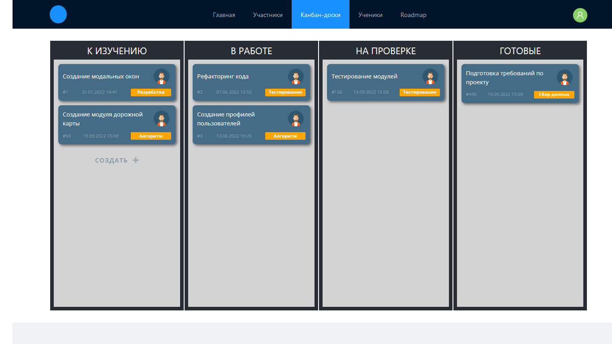
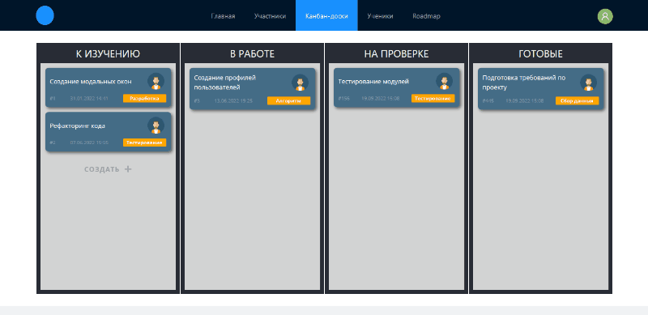

# Подробнее о проекте

## Оглавление

 

[Общий вид проекта](#общий-вид-проекта)

[С анимацией работы проекта](#с-анимацией-работы-проекта)

[Общая информация о модуле](#общая-информация-о-модуле)

[Дополнительная информация](#дополнительная-информация)

[Инструкция по запуску проекта](#инструкция-по-запуску-проекта)

 

## Общий вид проекта

 

## С анимацией работы проекта

 

## Общая информация о модуле

Модуль канбан-доски представляет собой четыре именованных колонки, в рамках которых можно перетаскивать стикеры задач. При перетаскивании подсвечивается та колонка, в пределах которой находится перемещаемый стикер задачи.

В первой колонке есть кнопка "Создать +" для создания новых стикеров.

В видимой части стикера задачи отображается следующая информация:
- название задачи;
- аватар стажёра-исполнителя;
- тип задачи, отображаемый в оранжевом блоке;
- ID задачи (порядковый номер);
- дата и время создания стикера задачи.

При клике на стикер задачи запускается модальное окно в режиме просмотра, в котором отображается содержимое стикера в полном формате со всеми данными, которые разделяются на основную информацию и блок аттрибутов. При клике на кнопку "Редактировать" открывается модальное окно в режиме редактирования, в котором можно изменить доступные для правки данные. Для полей названия и описания задачи установлены ограничения по минимальной и максимальной длине текста.

Модальное окно в режиме предупреждения запускается в случае, когда данные изменены и был осуществлён случайный клик за пределами модального окна с формой, либо был клик на одну из кнопок закрытия.

При перетаскивании стикера задачи в другую колонку автоматически изменяется внутренний аттрибут "Столбец". Все стикеры задач в одной колонке автоматически сортируются по дате создания.

 

## Дополнительная информация

Мне была поставлена задача реализовать канбан-доску и функционал создания, просмотра и редактирования стикеров задач. Связь с сервером в данной задаче не предусматривалась. Задача выполнена успешно полностью с нуля, включая разработку в Figma дизайна доски, стикеров и модальных окон.

 

---

## Инструкция по запуску проекта

- Клонируйте репозиторий: `git clone https://github.com/bubn0ff/stazherka.git`.
- Перейдите в папку с проектом `cd react_ts`.
- Установите зависимости: `npm install`.
- Запустите проект: `npm start`.
- В правом углу проекта в браузере нажмите "Sign in".
- В открывшейся форме введите моковые данные:
  - логин: admin@test.ru;
  - пароль: 123.
- Перейдите в модуль "Канбан-доски".

---

[к оглавлению](#оглавление)